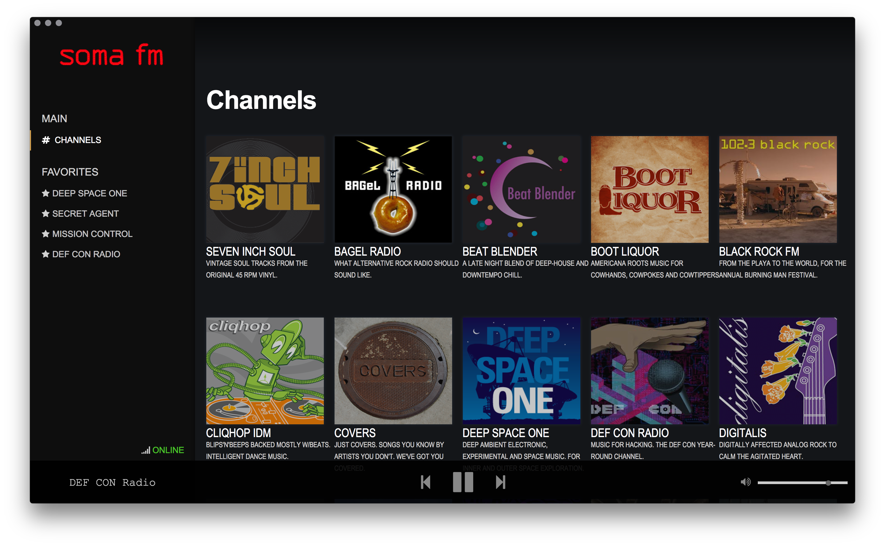

# 
A Desktop SomaFM Player.

http://somafm.com/

Built using [Electron](http://electron.atom.io) and [Node.js](https://nodejs.org/).

[](https://travis-ci.org/alfg/somafm)




\*SomaFM player is currently in Alpha!

## Features
* Cross Platform supporting OSX, Windows and Linux!
* Stream SomaFM Channels
* Save Favorite Channels

## TODO
* Chromecast Support
* Metadata Ingestion
* Settings
* Code Documentation
* Code Optimization
* Tests

## Install 

#### Homebrew
```
brew tap alfg/tap
brew cask install somafm
```

Or upgrade to latest:
```
brew update
brew cask install somafm --force
```

#### Download
See [Releases](https://github.com/alfg/somafm/releases) for binary downloads and source.

## Contributing
TBA

## Support SomaFM
SomaFM is entirely listener-supported and independent radio. You can support SomaFM by 
donating or purchasing merchandise at the following page:

http://somafm.com/support/

## Development
See: [Development](DEVELOPMENT.md)

## License
[MIT License](http://alfg.mit-license.org/)
